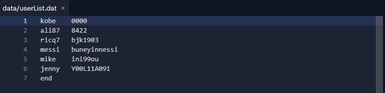

# DailyDiary
Journaling Application for personal use!
- C++
- Automatic Encryption/Decryption of Journal Entries
- User Login System (Albeit not secured)
- Ease of use including optional splitting of Journaling if needed

Usage: Simply run "make all" and execute "DailyDiary.out" to use.
Add your own username and password under "settings/userList.dat"

## Starting + Display

## Adding a Journal Entry

## Adding a seperate "Genre" to categorize specific parts of Entry

## Showcase of Encryption and Decryption

## Showcase of User Database

